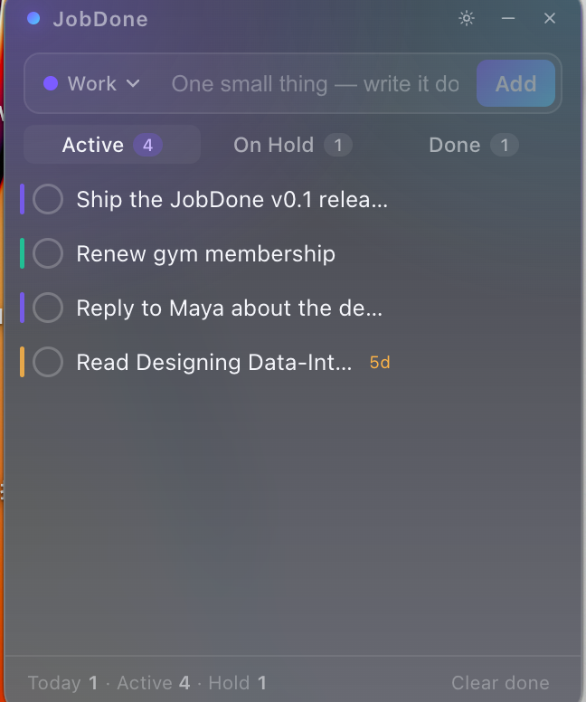

<div align="center">


# JobDone

**A floating, always-on-top todo widget for macOS that makes shipping feel good.**

Three states. Confetti when you finish. Lives in the corner of every workspace.
Your data stays on your machine.

[](#install)
[](LICENSE)
[](https://www.electronjs.org/)
[](#privacy)
[](#language)

<br />



</div>

---

## Why one more todo app?

Other apps are too much furniture. Notion needs a tab. Reminders needs a window. Sticky notes get lost behind everything.

JobDone is **a single 320×400 frame that's always there**, always on top, always one click away. You write it down, you finish it, you watch confetti, you keep going. That's the whole loop.

## Features

- **Always on top, every workspace** — no Cmd-Tab hunting, no docking and undocking
- **Three task states** that match how work actually works: **Active**, **On Hold**, **Done** — separate "doing" from "waiting on someone" from "shipped"
- **Editable color categories** — Work, Personal, Side Projects, whatever you want; rename, recolor, delete in Settings
- **Confetti on done** — small dopamine hit, big effect on momentum
- **Stale flag** — anything sitting Active for ≥ 3 days gets a quiet `3d` tag so it stops being invisible
- **Local-only storage** — one JSON file at `~/Library/Application Support/jobdone/jobdone.json`. Copy it to back up. No cloud, no sync, no account, no analytics.
- **Tray icon (✓)** in the menu bar — click to show/hide, right-click for options
- **English & 中文** — switch in Settings; defaults to your system language on first run

## Install

> JobDone is unsigned right now (no Apple Developer ID). The first time you open it, **right-click → Open** and confirm. Subsequent launches work normally.

### Build from source

```bash
git clone https://github.com/KoNananachan/JobDone.git
cd JobDone
npm install
npm run dist        # → release/mac-arm64/JobDone.app

# install it
mv release/mac-arm64/JobDone.app ~/Applications/
open ~/Applications/JobDone.app
```

That's it. Launch once, then drag `~/Applications/JobDone.app` to your Dock.

### Auto-launch on login

System Settings → General → Login Items → drag `JobDone.app` into the list.

### Updating to a new version

Your data lives **outside** the `.app` bundle, at
`~/Library/Application Support/jobdone/jobdone.json`, so updating is safe — just rebuild and replace:

```bash
cd JobDone
git pull
npm install        # only if package.json changed
npm run dist
rm -rf ~/Applications/JobDone.app
cp -R release/mac-arm64/JobDone.app ~/Applications/
```

JobDone also writes a defensive snapshot of your data on launch (max one per
24 h, keeping the last 10) at
`~/Library/Application Support/jobdone/jobdone.snapshot-YYYY-MM-DDTHH-MM-SS.json`.
If anything ever goes sideways, copy the most recent snapshot back over
`jobdone.json` and relaunch.

## Usage

| Action | How |
| --- | --- |
| Add a task | Type into the box, hit `Enter` |
| Pick category before adding | Click the colored chip (e.g. `• Work ▾`) — defaults to Work |
| Mark done | Click the circle on the left → 🎉 |
| Put on hold | Hover the row → click ⏸ |
| Resume | Hover the row → click ▶ |
| Edit text | Double-click the text, **or** hover → click ✎ |
| Move category | Hover → click the folder icon → pick |
| Delete | Hover → click × |
| Open Settings | ⚙ in the title bar |
| Hide to tray | × in the title bar (window doesn't actually close) |
| Quit | Right-click the menu-bar ✓ → Quit |

## Settings

In the ⚙ panel:

- **Language** — English / 中文 (defaults to system on first launch)
- **Categories** — color, name, add/delete (deleting a category does **not** delete tasks; they become Uncategorized)
- **Data** — shows the local JSON path; copy that single file to back up everything

## Privacy

JobDone is offline-first by design.

- No accounts, no sign-in
- No network requests after launch (everything runs locally)
- No analytics, no crash reporting, no telemetry
- All data lives in a single file at `~/Library/Application Support/jobdone/jobdone.json`
- On each launch a defensive snapshot is written next to it (`jobdone.snapshot-…json`, last 10 kept), so updates can't accidentally lose your tasks

To wipe everything, delete that folder.

## Tech

- **Electron 31** (renderer is contextIsolated, sandboxed preload)
- **React 18 + TypeScript**, **Vite** for the renderer
- **~11 KB CSS**, no UI framework — design lives in `src/styles.css`
- One JSON file for state, plain `fs` writes from the main process via IPC
- Icon generated programmatically with Canvas (`scripts/make-icon.cjs`) — no Figma required

```
src/
  App.tsx         # all UI + state
  store.ts        # load/save the JSON
  i18n.ts         # EN + ZH strings
  confetti.tsx    # celebratory canvas particles
  styles.css      # all of the look
electron/
  main.cjs        # window, tray, IPC handlers
  preload.cjs     # contextBridge surface
```

## Development

```bash
npm run dev       # Vite + Electron with HMR
npm run build     # Build the renderer to dist/
npm start         # Run Electron against the built renderer
npm run pack      # Package an unsigned .app to release/mac-arm64/
npm run dist      # Same as pack but produces a .dmg too
npm run make-icon # Re-render build/icon.png from scripts/make-icon.cjs
```

After re-rendering the icon PNG, regenerate the `.icns`:

```bash
mkdir -p build/icon.iconset
for s in 16 32 128 256 512; do
  sips -z $s $s build/icon.png --out build/icon.iconset/icon_${s}x${s}.png
  sips -z $((s*2)) $((s*2)) build/icon.png --out build/icon.iconset/icon_${s}x${s}@2x.png
done
iconutil -c icns build/icon.iconset -o build/icon.icns
```

## Roadmap

- [ ] Signed + notarized release builds (Apple Developer ID)
- [ ] Global hotkey to focus the input from anywhere
- [ ] Drag to reorder tasks
- [ ] Optional Markdown-style links in task text
- [ ] Linux + Windows builds (the renderer already runs there; just needs window-management polish)

## Contributing

PRs welcome — especially design tweaks, additional translations, and accessibility passes.

For new translations, add a locale to `src/i18n.ts` following the existing English entry, then surface a button in `SettingsPanel`.

## License

MIT © 2026 [KoNananachan](https://github.com/KoNananachan). See [LICENSE](LICENSE).

---

<div align="center">
<sub>If JobDone helped you ship something, ⭐ the repo. That's the whole exchange.</sub>
</div>
